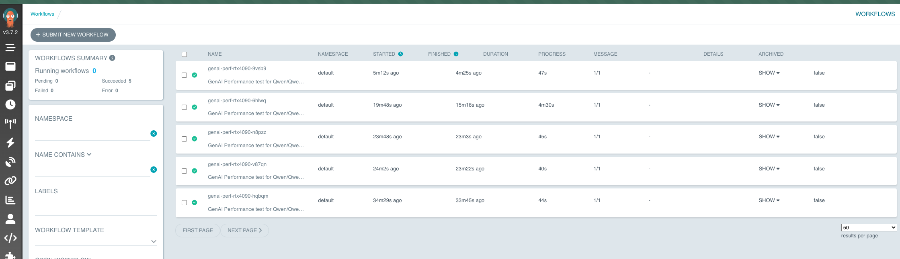
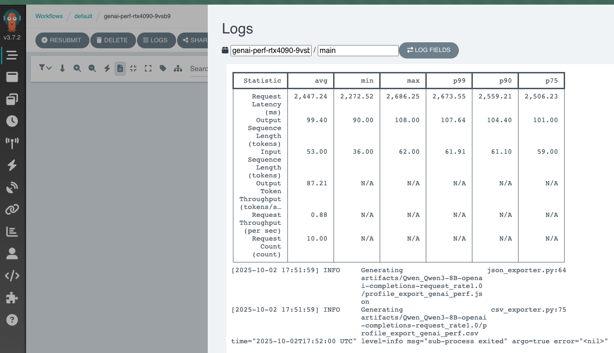

# Model infrastructure Analyzer

Код содержит манифесты для построения лаборатории подбора инфраструктуры для LLM. Подробнее узнать можно из доклада конференции [Я про бэкенд](https://events.yandex.ru/events/yaprobackend?utm_source=tg&utm_medium=social&utm_campaign=ypb_promo_speakers&utm_content=anton_alekseev). 

С помощью terraform вы сможете воссоздать инфраструктуру в k8s для тестирования различных GPU (например в облаке Selectel).

Далее в блоке kubernetes вы найдете манифесты, необходимые для воссоздания лаборатории.

Полная установка также доступна в [скрипте](./infra-install.sh). Предварительно настройте окружение (см. следующий пункт) и выполните команду.

```bash
./infra-install.sh all
```

## Быстрый старт: запуск Terraform

Данная инструкция подходит к облаку Selectel, но концептуально можно воссоздать в любом другом облаке.

### 1. Настройка окружения

- Скопируйте `.envrc` в `.envrc.local`:
  ```sh
  cp terraform/.envrc terraform/.envrc.local
  ```
- Заполните все переменные в `.envrc.local` своими значениями (см. шаблон в `.envrc`).
- Примените переменные окружения:
  ```sh
  cd terraform
  source .envrc.local
  ```

### 2. Подготовка flavor_id для GPU

- flavor_id для GPU-нод задаются в файле `vars.tfvars`:
  ```hcl
  gpu_az_flavors = {
    a = ["3041"]
    b = ["3800", "3103", "3073"]
    c = []
  }
  ```
  Ключ — буква зоны доступности (a, b, c), значение — список flavor_id.

- Найти нужные flavor_id можно через OpenStack CLI:
  ```sh
  openstack flavor list --long | grep 5000
  ```
  (или подставьте нужное название/тип GPU)

- Дополнительно в `vars.tfvars` можно задать другие параметры инфраструктуры:
  ```hcl
  sfs_size = 1024  # размер NFS хранилища в GB
  k8s_version = "v1.26.1"  # версия Kubernetes
  ```

### 3. Запуск Terraform

- Проверьте план:
  ```sh
  terraform plan -var-file=vars.tfvars
  ```
- Примените изменения:
  ```sh
  terraform apply -var-file=vars.tfvars
  ```

### 4. Результат

- Будет создан кластер Kubernetes с GPU-нодами по flavor_id из `vars.tfvars`.
- Также создастся SFS (NFS) для шаринга данных между подами.
- kubeconfig для доступа к кластеру будет выведен в output (`terraform output kubeconfig`).
- Адрес SFS — в output `sfs_address`.


## Настройка Kubernetes кластера

После создания инфраструктуры с помощью Terraform, необходимо настроить кластер Kubernetes для работы с GPU и запуска тестов производительности.

### 1. Настройка доступа к кластеру и окружения

Сохраните kubeconfig из output Terraform:
```sh
terraform output kubeconfig > ~/.kube/config
```

Проверьте доступ к кластеру:
```sh
kubectl get nodes
```

Добавьте необходимые чарты

```
helm repo add nvidia https://nvidia.github.io/gpu-operator
helm repo add prometheus-community https://prometheus-community.github.io/helm-charts
helm repo add argo https://argoproj.github.io/argo-helm 
helm repo add vllm https://vllm-project.github.io/production-stack
helm repo update
```

### 2. Установка NVIDIA GPU Operator

GPU Operator устанавливает драйверы NVIDIA и необходимые компоненты для работы с GPU:

```sh
helm upgrade --install gpu-operator -n gpu-operator --create-namespace nvidia/gpu-operator -f kubernetes/1-gpu-operator/values.yaml
```

Дождитесь установки всех компонентов:
```sh
kubectl get pods -n gpu-operator
```

### 3. Настройка NFS хранилища

Примените PV и PVC для NFS, сгенерированные Terraform:
```sh
kubectl apply -f kubernetes/nfs-pv-pvc.yaml
```

### 4. Установка секрета с токеном Hugging Face

Создайте секрет с токеном доступа к Hugging Face:
```sh
kubectl create secret generic hf-token-secret --from-literal=hf-token='ваш_токен_hugging_face'
```

### 5. Установка vLLM для запуска моделей

Установите vLLM stack с настройками для выбранных GPU:
```sh
helm upgrade --install vllm vllm/vllm-stack -f kubernetes/3-vllm/production-stack-values.yaml
```

В файле `production-stack-values.yaml` можно настроить параметры запуска моделей, распределение GPU и другие настройки.

Важно: для каждой модели необходимо задать размеры (ресурсы) нод/запросы пода в values vLLM. В `kubernetes/3-vllm/production-stack-values.yaml` укажите для соответствующего профиля модели:

- `requestCPU` — сколько CPU запрашивает под
- `requestMemory` — объём памяти, например `"8Gi"`
- `requestGPU` — количество GPU, например `1`

Эти параметры определяют необходимый размер ноды и планирование на GPU. Подбирайте значения под конкретную модель, иначе под может не уместиться на доступные ноды или не получит требуемые ресурсы.

### 6. Установка Argo Workflows

Установите Argo Workflows для управления тестами производительности:
```sh
helm upgrade --install argo-workflows argo/argo-workflows -n argo --create-namespace -f kubernetes/4-argoworkflows/values.yaml
```

Для доступа к UI Argo Workflows:
```sh
kubectl port-forward svc/argo-workflows-server -n argo 2746:2746
```

Затем откройте в браузере: http://localhost:2746

Для получения токена доступа:
```sh
kubectl -n argo create token argo-workflows-server
```
Также добавьте префикс `Bearer ` к токену при авторизации в UI Argo Workflows.


## Запуск тестов производительности с genai-perf

### 1. Установка шаблонов Argo Workflow

Примените шаблоны для запуска тестов genai-perf (шаблоны позволяют использовать разные режимы genai):
```sh
kubectl apply -f kubernetes/5-genai-perf/model-test/templates
```

Также вы можете добавить примеры кастомных промптов через configmap
```sh
kubectl apply -f kubernetes/5-genai-perf/model-test/configmaps
```

### 2. Запуск тестов производительности

Для конфигурации genai perf стоит ознакомиться с [документацией](https://github.com/triton-inference-server/perf_analyzer/tree/3c0bc9efa1844a82dfcc911f094f5026e6dd9214/genai-perf).

#### Режим analyze (анализ производительности)

```sh
kubectl create -f kubernetes/5-genai-perf/model-test/genai-perf-rtx4090-analyze-concurrency
```

#### Режим profile (профилирование)
Тестирование на 1 и 5 rps
```sh
kubectl create -f kubernetes/5-genai-perf/model-test/genai-perf-rtx4090-profile-rate-1.yaml
kubectl create -f kubernetes/5-genai-perf/model-test/genai-perf-rtx4090-profile-rate-5.yaml
```

Тестирование с данными из configmap

```sh
kubectl create -f kubernetes/5-genai-perf/model-test/genai-perf-rtx4090-profile-with-data.yaml
```

### 3. Мониторинг выполнения тестов

Отслеживайте статус выполнения через Argo UI или командой:
```sh
kubectl get workflows
```

Для просмотра логов конкретного workflow:
```sh
kubectl logs -l workflows.argoproj.io/workflow=имя_workflow
```

## Анализ результатов тестов

### 1. Запуск JupyterLab для анализа

Установите JupyterLab для доступа к результатам тестов:
```sh
kubectl apply -f kubernetes/2-jupyterlab/jupyterlab-deployment.yaml
```

Для доступа к JupyterLab:
```sh
kubectl port-forward svc/jupyterlab 8888:8888
```

### 2. Работа с результатами

Результаты тестов genai-perf сохраняются в NFS хранилище и доступны через JupyterLab. Путь к результатам:
```
/work/genaiperf-{модель}-{gpu}/
```

В этой директории можно найти:
- Графики производительности
- Логи тестов
- Метрики и статистика


Также в Argoworkflows можно просматривать и сравнивать разные запуски тестов.



И сравнивать логи.


## Расширение и кастомизация

### Добавление новых моделей

Для тестирования новых моделей создайте новые workflow-файлы на основе существующих шаблонов, изменив параметры:
- Название модели
- URL сервиса
- Тип GPU
- Параметры тестов

### Кастомизация тестов

Шаблоны в директории `kubernetes/5-genai-perf/templates/` можно модифицировать для добавления новых параметров или изменения логики тестирования.
